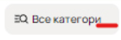
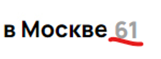
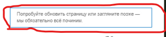
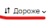
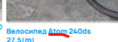
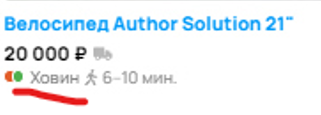
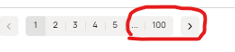

## Баги на странице со скриншота

**1. [Кнопка “Все категории”]** Орфографическая ошибка. "Все категориИ"

Приоритет: low  

**2. [Фильтр горные]** Отсутствует отображение, что выбраны горные велосипеды.

Приоритет: low  

**3. [Неверное отображение кол-ва результатов]** Исходя из того, что отображаются велосипеды одной марки, которая выбрана в фильтре,
сделан вывод, что фильтр применен. Следовательно, кол-во найденных должно совпадать с предлагаемым вариантом.

Приоритет: high  

**4. [Баннер об ошибке]** Баг под *. Вероятно, он функционирует исправно, чем и объясняется такое кол-во багов на странице.
Необходимо проверить в динамике и уточнить причины появления данного баннера.

Приоритет: low  

**5. [Отображение на карте]** Отображение объявлений в виде плиток вместо визуализации на карте.

Приоритет: high  

**6. [Фильтр "Дороже" не работает]** Объявления не отсортированы от самых дорогих до самых дешевых. 

Приоритет: high  

**7. [Фильтр по бренду не работает]** В выдаче результатов присутствует один велосипед другого бренда. Есть вероятность,
что вывод о том, что фильтры применены, ошибочен. Поэтому необходима проверка в динамике. Но по умолчанию считаем что он применен.

Приоритет: high  

**8. [Город Липецк указан при выдаче в Москве]** Выдает результат из города Липецк и указвает московское метро. Результаты
должны быть из города Москва.

Приоритет: high 

**9. [Станции метро Звенигородская нет в Москве]** Выдает станцию метро СПб в московской выдаче.  

Приоритет: high  

**10. [Станции метро Ховин не существует]** Опечатка, но может смутить потенциального покупателя и на объявление
никто не откликнится.

Приоритет: medium  

**11. [Пешком от метро 11 часов]** Нереалистичное время маршрута пешком. Посетитель могут не посмотреть объявление, решив,
что слишком далеко местоположение.

Приоритет: medium  

**12. [Пагинация на 100 страниц]** При выдаче 61 результата слишком много страниц. 

Приоритет: low  

